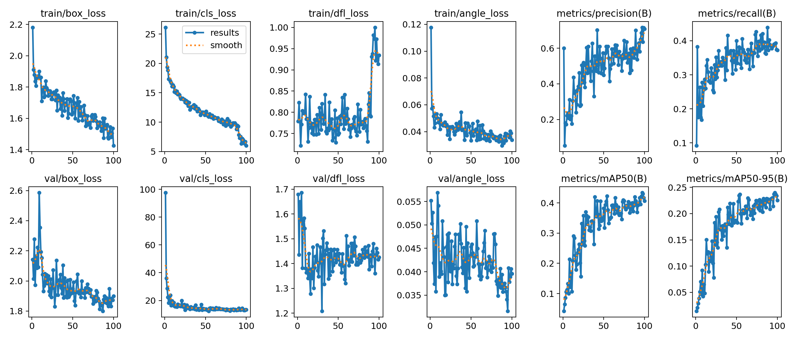
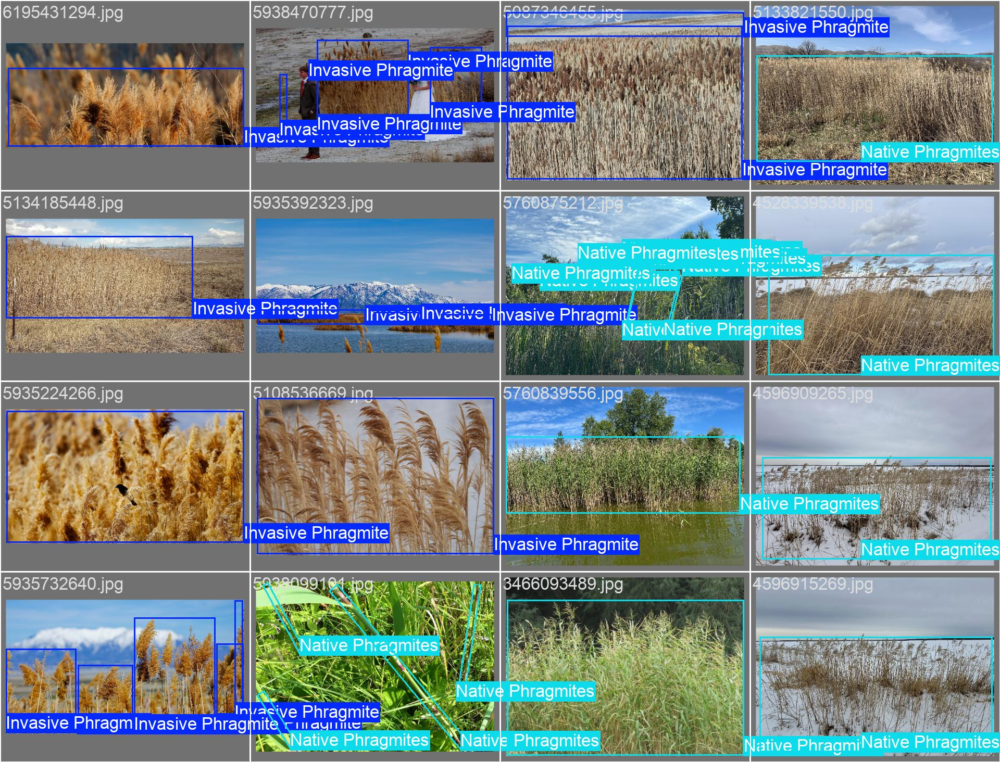
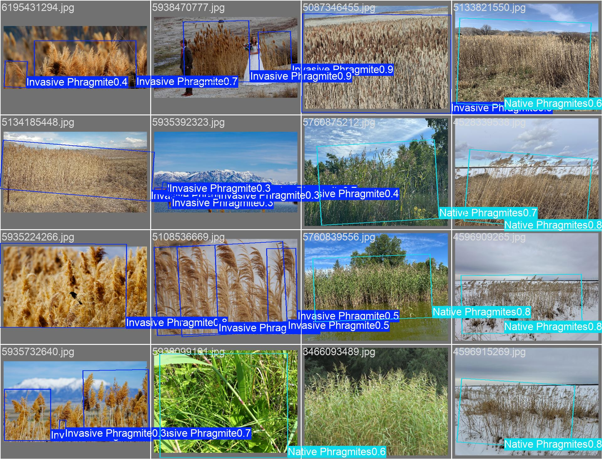

# Phragmite Detection Project

## This project aims to help restore the Great Salt Lake by mapping populations of invasive phragmites 

The Great Salt Lake is threatened by many issues today, including smaller water supply
and faster evaporation due to climate change, diverted water supplies due to human usage, and
invasive plants. Some have even estimated that without drastic action, the lake could disappear
within the decade (Abbott et al., 2023). Even if it doesn’t fully disappear by that timeline, the
drying lake already has miles of dry, exposed lakebed feed toxic dust clouds throughout the
neighboring communities. This is an urgent issue that has received national attention, and there
are many strategies being made to help save the lake.

One of the many strategies is removing phragmites, an invasive reed-like plant, from the
lake. This plant not only harms native species, but it also can physically block water from getting
to the lake and uses much more water than the native plants it displaces. It consumes
“approximately 3.62 acre-ft of water per acre of Phragmites compared to 1.55 acre-ft of water per
acre of Inland Saltgrass” (Utah Division of Forestry, Fire and State Lands, 2024). Some believe
that removing the phragmites could restore 80,000 acre-feet of water per season to the lake, which
would be a meaningful contribution to the lake’s restoration (Burky, 2026).

A major block to removing these weeds is that state agencies don't know where they are. The vast area around the Great Salt Lake is difficult to catalog, and state agencies are working to create models that use satellite imagery as well as drone footage to map populations for removal. I am proposing we add an additional data source to these maps. If we can crowd source images of phragmites, along with their location, we can map populations of phragmites that state agencies might never know about otherwise. Some stands are hidden under trees that satellite images would never find, or tucked into areas that drones might never be sent to. Even if these populations are not as huge as the ones state agencies are already mapping, their seeds and rhizomes can quickly spread to fill areas up with weeds even as agencies remove them. 

## Detection Model

The first phase of this project is fine-tuning a YOLO detection model to identify invasive phragmites in images. I am using images from GBIF. As a trial run, I downloaded approximately 200 examples of invasive phragmites, along with approximately 200 examples of native phragmites, which are less aggressive and should not be removed like their invasive relatives. I used CVAT to draw bounding boxes around these images before feeding them into my model. 

Several problems need to be solved in future runs. First, I need to gather and label many more images, as well as more background images of native species around the Great Salt Lake. 

Second, I need to experiment with different standardized bounding box strategies. Currently these boxes are drawn haphazardly, with no consistency as far as when groups of phragmites are labelled with one bounding box vs multiple, when to include blurry examples in the background, when to isolate sparse examples vs include them in one large box, etc. Here is an example of my labelled images currently:

For reference, here are the labels generated by this first model. Notice that even when it correctly identifies the species of phragmites, it gets confused on exactly how to lay out the bounding boxes and when to use one vs multiple bounding boxes: 

## Future Additions

As the model gets better at identifying invasive phragmites, the goal is to wrap it into an app that allows users to upload photos, along with their location, in order to map images of phragmites around the Salt Lake area. Essentially, I want to use crowd sourcing to map these weeds, and send data to state agencies.

## Sources
Abbott, B. W., Baxter, B. K., Busche, K., et al. (2023). Emergency measures needed to rescue
Great Salt Lake from ongoing collapse. Brigham Young University.
https://digitalcommons.usu.edu/wats_facpub/1212

Burky, I. (2026, April 16). Utah takes aim at invasive reeds to help refill Great Salt Lake. Utah
Public Radio. https://www.upr.org/environment/2026-04-16/great-salt-lake-phragmites-
invasive-reeds

Utah Division of Forestry, Fire and State Lands. (2024). Great Salt Lake phragmites strategy.
Utah Department of Natural Resources. https://ffsl.utah.gov/wp-content/uploads/GSL-
Phragmites-Strategy-Overview-and-Reduction-in-water-depletions.pdf

